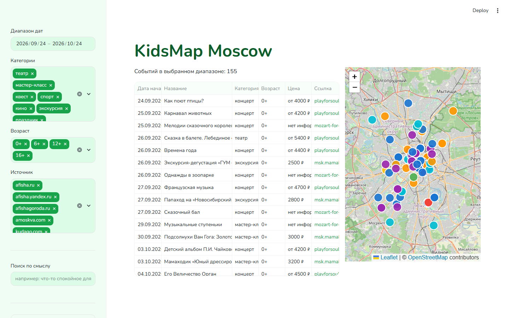
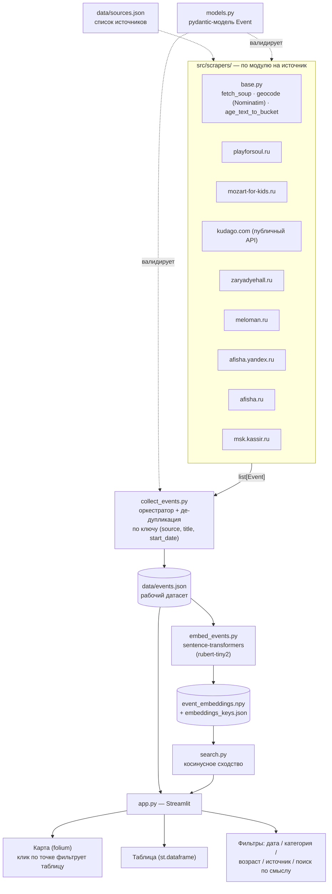

# KidsMap Moscow

Карта детских событий Москвы на [Streamlit](https://streamlit.io): фильтры по дате,
категории, возрасту и источнику, поиск по смыслу запроса и синхронизация карты
с таблицей.

🔗 **Приложение:** [kidsmap-moscow.streamlit.app](https://kidsmap-moscow.streamlit.app/)



## Возможности

- Карта событий (`folium`) с цветовой кодировкой по категориям, клик по точке
  фильтрует таблицу до выбранного события. Поддержка светлой и тёмной темы.
- Фильтры в сайдбаре: диапазон дат, категории, возраст, источник данных.
- Семантический поиск по смыслу запроса (`sentence-transformers`,
  `cointegrated/rubert-tiny2`) — например, «что-то спокойное для трёхлетки».
- Данные собираются автоматически с восьми источников (см. `data/sources.json`).

## Стек

Python 3.11+, Streamlit, folium/streamlit-folium, pandas, pydantic,
sentence-transformers, requests + BeautifulSoup4.

## Установка и запуск

```bash
python -m venv .venv
.venv\Scripts\activate        # Windows; на Linux/macOS — source .venv/bin/activate
pip install -r requirements.txt
streamlit run src/app.py
```

## Сбор данных

```bash
python -m src.collect_events   # скрапинг всех источников, результат — data/events.json
python -m src.embed_events     # пересчёт эмбеддингов для семантического поиска
```

## Как это устроено



**Источники и конфигурация.** `data/sources.json` перечисляет источники (название +
URL) — это справочный список для людей и для будущих скраперов, а не то, что
парсится программно на лету: каждый источник обслуживается отдельным модулем в
`src/scrapers/`.

**Скрапинг.** Для каждого сайта — свой модуль с функцией `scrape() -> list[Event]`.
Общая логика вынесена в `src/scrapers/base.py`: загрузка и парсинг HTML
(`fetch_soup`, с обходом проблем SSL-сертификатов через `truststore`),
геокодирование адресов площадок через Nominatim (OpenStreetMap) с файловым кэшем
(`data/geocode_cache.json`), приведение возрастных пометок к общим категориям
(`age_text_to_bucket`). Часть источников отдают данные через встроенный JSON
(например, `kudago.com` — через официальный публичный API), часть — парсятся из
вёрстки страницы.

**Модель данных.** Все события приводятся к единой pydantic-модели `Event`
(`src/models.py`) ещё на этапе скрапинга — «сырых» словарей в рабочем коде нет.
Это даёт валидацию на входе и единый контракт для всех последующих шагов.

**Сбор и объединение.** `collect_events.py` — оркестратор: запускает все скраперы,
объединяет результат с уже накопленным `data/events.json` и отбрасывает дубликаты
по составному ключу `(источник, название, дата начала)`, а не по URL — у многих
источников нет постоянной ссылки на конкретное событие.

**Семантический поиск.** `embed_events.py` считает эмбеддинги описаний событий
моделью `cointegrated/rubert-tiny2` (компактная модель для русского языка) и
сохраняет их в `data/event_embeddings.npy`, а сопоставление с событиями — по тому
же ключу `event_key()`, что и де-дупликация, для устойчивости к переупорядочиванию.
`search.py` при поиске считает косинусное сходство между эмбеддингом запроса и
эмбеддингами событий.

**Приложение.** `app.py` — Streamlit-интерфейс: боковая панель с фильтрами,
таблица и карта (`folium`/`streamlit-folium`) рядом. Клик по точке на карте
сопоставляется с событием через текст всплывающей подсказки (а не координаты —
Leaflet отдаёт координаты клика мыши, а не точный центр маркера) и сужает
таблицу до одного события. Тема (светлая/тёмная) настраивается через
`.streamlit/config.toml`, карта под тёмную тему переключается на тёмные тайлы
Esri (бесплатно, без API-ключа).

## Структура проекта

```
src/
├── app.py              # Streamlit-приложение
├── models.py            # pydantic-модель Event
├── data.py               # загрузка, фильтрация, де-дупликация событий
├── classify.py             # правила классификации по возрасту
├── collect_events.py        # оркестратор сбора данных со всех источников
├── embed_events.py           # предвычисление эмбеддингов для поиска
├── search.py                  # семантический поиск по эмбеддингам
└── scrapers/                   # по одному модулю на источник
data/
├── events.json           # рабочий датасет событий
├── seed_events.json       # вручную собранные события (стартовый набор)
├── sources.json             # список источников для скрапинга
└── geocode_cache.json        # кэш геокодирования площадок (Nominatim)
```
